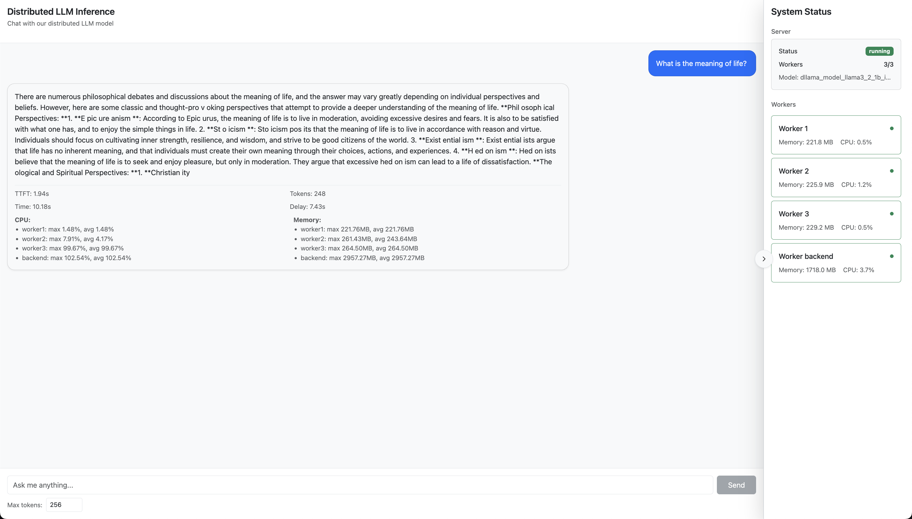

# Docker Distributed LLM
This is a final project for UIUC CS598 FLA: Systems for GenAI, Spring 2025

Note: `main` branch is setup to support an experiment with the Llama3.2 1B Q40 model with n=4 total workers and 1 CPU thread per worker. Additional experiments can be run on different branches with some minimal extra setup. See the bottom of this README for more details.

# Simulated Distributed Language Model System

We developed a containerized version of [b4rtaz's dllama repo](https://github.com/b4rtaz/distributed-llama), using Docker and Python (Flask). This version simulates distributed CPU inference on edge devices with a **configurable latency range**. Given this range, we simulate realistic edge device inference on a single device with randomized communication latency. 

We provide a clean frontend user interface, accessible at http://localhost:3001 once the docker system has been setup. This interface enables prompting and measurement of response time metrics (TTFT, TTLT, simulated latency) as well as CPU/GPU metrics on a per-container basis. 



Our project was run on an M3 Macbook Pro with Docker Desktop 28.0.1 linux/arm64. The code in the main branch represents a system with 4 total nodes (the backend is always the "root" node) and using the Llama 3.2 1B Instruct Q40 model. 

## Prerequisites
- Docker
- Docker Compose
- Python3
- C++ compiler

## Setup and Running Instructions

1. Clone the repository:
   ```bash
   git clone <repository-url>
   cd docker-distributed-llm
   ```

2. Run the file `model_downloader.py` in `model_downloader/` to ensure there is a model included in `/models` so that it may be copied over to the volume of the root worker (backend). For reference, for the 1B model, the structure should be:

```
models/
-- llama3_2_1b_instruct_q40/... (tokenizer and model file here)
```

Make sure that the backend (root node) has enough memory for the model file, tokenizer, and for some of the workload during inference. This can be configured in the `docker-compose.yml`. 

3. Modify configuration files as needed given your target inference setup. These files are located at `backend/config.py` and `worker/worker_wrapper.py`.

To modify the ranges of randomized latency generation, we provide `LATENCY_MIN` and `LATENCY_MAX` in `backend/config.py`. 

4. Build and start the containers:
   ```bash
   docker compose up --build
   ```

5. Access the frontend at http://localhost:3001 to enter a prompt and begin inference. The max tokens can be modified to be any value from 1 -  1024. System status is observed in the right-hand panel. 

To stop the services:
   ```bash
   docker compose down
   ```

To view logs:
   ```bash
   docker compose logs -f
   ```

Logs are also easily viewable with Docker Desktop. 

Additional instructions to contextualize the code and model downloader can be found at [b4rtaz's dllama repo](https://github.com/b4rtaz/distributed-llama).

## Troubleshooting

- If you encounter permission issues, try running the commands with sudo
- To rebuild a specific service:
  ```bash
  docker compose build <service-name>
  ```
- To restart a specific service:
  ```bash
  docker compose restart <service-name>
  ```

## Swapping Models / Configuration for Experiments

To reproduce our experimental results, you can easily swap the model and number of workers under our architecture (see step 3 for details on modifying relevant configuration files). 

For convenience, we provide a set of branches that are used to run our experiments. The naming convention of branches is `modelsize-quant-nodes-threads`. Folowing this, we provide the following branches: 
- 1b-q40-1-1 
- 1b-q40-2-1 
- 1b-q40-8-1 
- 1b-q40-4-2 
- 1b-q40-4-3
- 1b-f32-1-1
- 1b-f32-2-1
- 1b-f32-8-1
- 1b-f32-4-2
- 1b-f32-4-3
- 3b-q40-1-1
- 3b-q40-2-1
- 3b-q40-8-1
- 3b-q40-1-1
- 3b-q40-4-1
- 3b-q40-4-2
- 3b-q40-4-3

Note that under this convention, `main` would be equivalent to a branch named `1b-q40-4-1`. For the F32 branches, we had to convert original F32 Llama 3.2 weights/tokenizer using the converter provided by the original dllama repo. For convenience of reproduction, we provide the following Google Drive folder to the raw model files/weights, accessible to @illinois.edu domains: https://drive.google.com/drive/folders/1G0McEWNwNiwAkHzGOzxorPRK4p7THlNY?usp=sharing. 

For context on how we made these branches, assuming a new experiment with two total nodes and a different model, you would:
1. Download the model files (weights and tokenizer) to `models/`
2.  Modify the `docker-compose.yml` (comment out the unnecessary nodes)
3. Modify the `config.py` files in `backend/` and `worker/` according to the `docker-compose` - that is, ensure that the worker URLs, worker IPs, model files, and threads match up

After any changes, you **must** `docker compose down` and `docker compose up --build` to rebuild the system. Then, you may access the frontend at http://localhost:3001 per usual and prompt. 

For any questions, please contact (insert our emails here).
